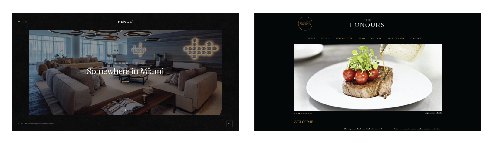
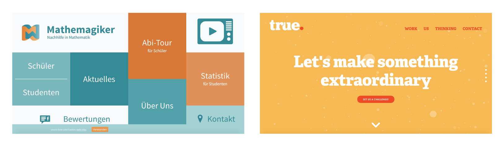
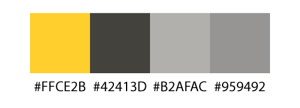
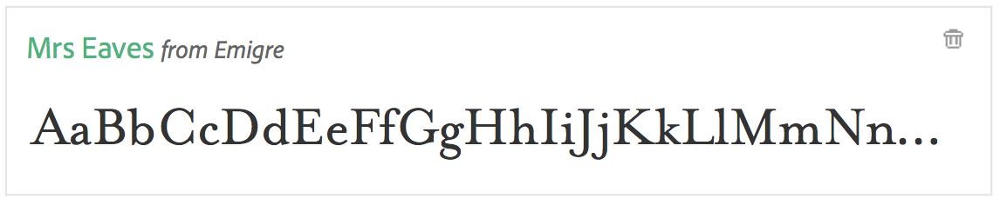
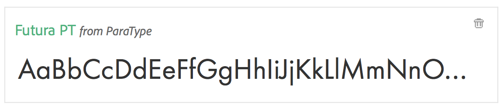
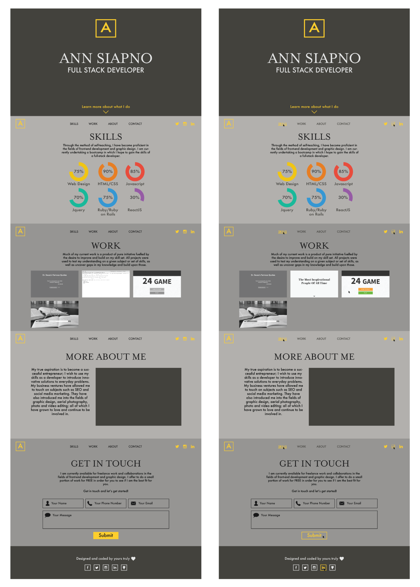
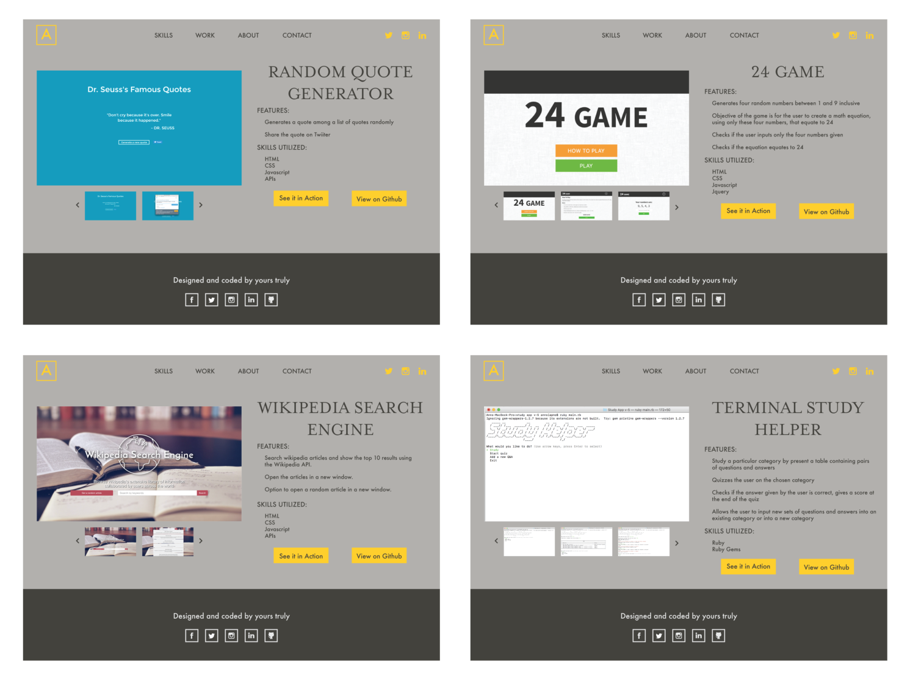
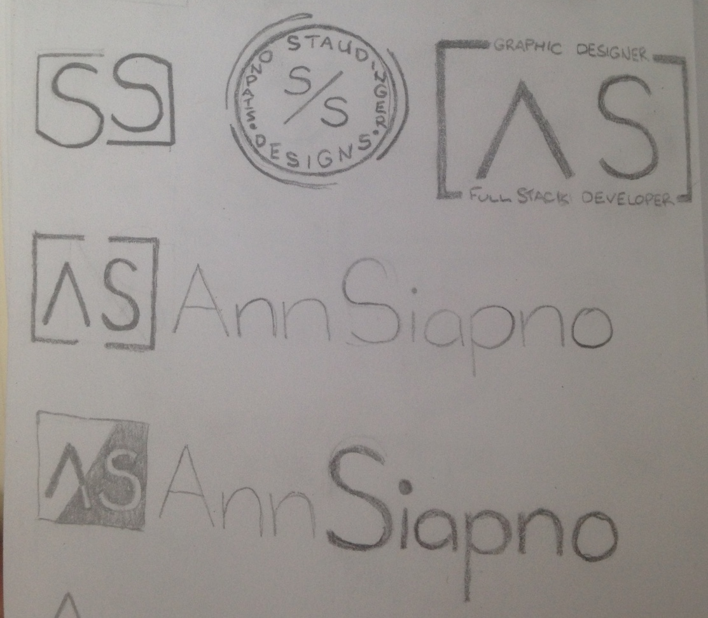

## Aim

Create a visually appealing, attention-grabbing, clean and concise online portfolio that highlights my skills, goals and personality in the hopes to attract new clients or build on my personal brand. 

## Target Audience

Start-ups, small businesses and entrepreneurs. 

### Characteristics (and how it to work with them)

* Highly protective of their idea/business.
    *  Look like a professional, emphasise on experience and show previous work.
* They have little funds.
    *  Be affordable, look approachable and not too ‘corporate’. 
* Lacking knowledge on the given field.
    * Look like a professional, with each project outline what is being done.
* Their employees tend to ‘wear many hats’.
    * Highlight that I have touched on subjects involved in business and show examples of my business ventures.
* Fast-paced work environment with tight deadlines.
    * Outline my work ethic.

## Design

Goal: Look professional but approachable

### Colour Palette

#### Professional/Luxurious websites

Dark and neutral colour scheme

#### Fun, modern websites

Bright, flat colour scheme

#### My Colour Scheme

Grey base colours and one bright, flat accent colour

### Font Family

#### Section and page headers

A thick serif font for a professional feel

#### Other page content (p, footer, nav etc.)

A sans-serif font of medium thickness to balance out the 'luxurious feel from the serif font

### Layout

* Clean with minimal text
* Visual tools - skills graph
* Accent colour for call to action buttons
* Accent colour for other focal points - social media buttons in navbar and "learn more" in hero section
* Obvious hover states - change of colour or from fill to outline

### Personal logo

A simple monogram logo

### Usability and User Experience

#### Simplicity

Clean design, readable typography, maximum of four colours in the colour scheme

#### Visual Hierarchy

Call-to-action buttons are yellow, other points of interest are coloured

#### Navigability

Sticky navbar, logo sends you back to the homepage, minimal options in the navbar

#### Accessibility

Responsive design, alt-text included with all images, readable text

#### Conventionality

Logo in the top-left corner, hoverlinks applied, clickable logo

## Sections

Sections are ordered to what is more valuable to the target audience. Each section is aimed to lure the audience into finding out more and, therefore, scrolling further into the other sections.

### Skills

Goal: Highlight my current skills but outline that my skills are expanding. Use visual aid so that the user can encapsulate what I can do quickly rather than reading lare amounts of text.

### Work

Goal: Show my previous experience, explore what I have been able to do. Show my drive and work ethic. 

### About Me

Goal: Highlight my experience in business to attract my target audience. Touch on my passions to reveal a bit of my personality. 

### Contact Me

Goal: Friendly and approachable with a subtle sales pitch to further intrigue the audience. 
