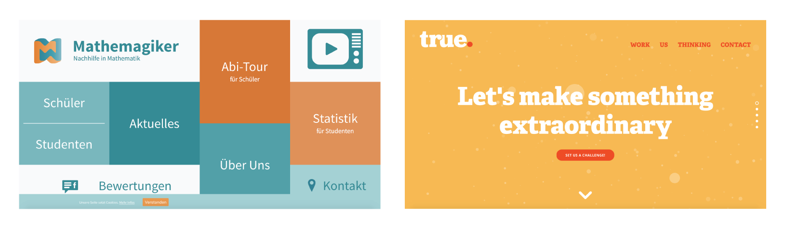

## Aim

Create a visually appealing, attention-grabbing, clean and concise online portfolio that highlights my skills, goals and personality in the hopes to attract new clients or build on my personal brand. 

## Target Audience

Start-ups, small businesses and entrepreneurs. 

### Characteristics (and how it to work with them)

* Highly protective of their idea/business.
    *  Look like a professional, emphasise on experience and show previous work.
* They have little funds.
    *  Be affordable, look approachable and not too ‘corporate’. 
* Lacking knowledge on the given field.
    * Look like a professional, with each project outline what is being done.
* Their employees tend to ‘wear many hats’.
    * Highlight that I have touched on subjects involved in business and show examples of my business ventures.
* Fast-paced work environment with tight deadlines.
    * Outline my work ethic.

## Design

Goal: Look professional but approachable

### Colour Palette

#### Professional/Luxurious websites

Dark and neutral colour scheme

#### Fun, modern websites

Bright, flat colour scheme

#### My Colour Scheme

